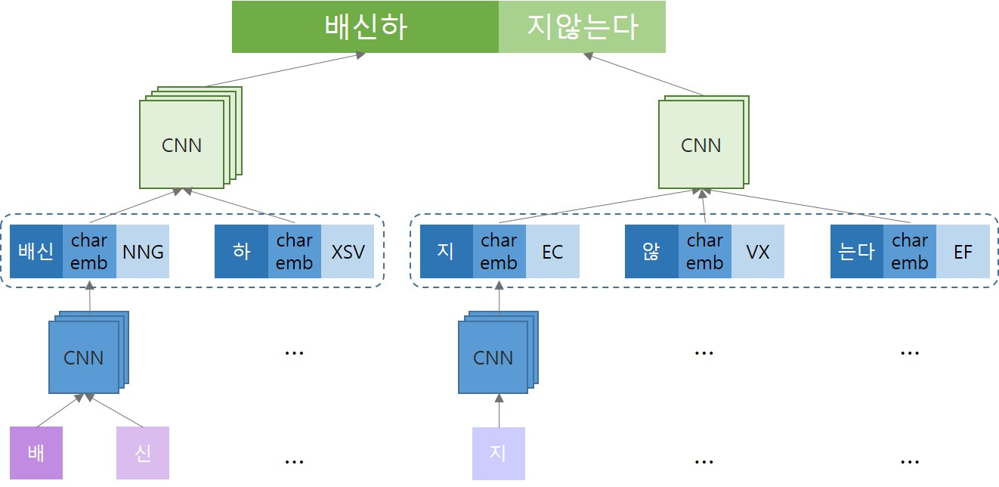

# Stack-PointerNetworks-KoreanDep.Parsing_with_chunking-

This project is for Korean dependency parsing with __chunking__.  
The code is based on the papers and codes below:
* Ma, X. et al. (2018). "Stack-Pointer Networks for Dependency Parsing", _In Proceedings of the 56th Annual Meeting of the Association for Computational Linguistics_, pp.1403-1414.  
  [ [paper](https://arxiv.org/pdf/1805.01087.pdf) ] [ [code](https://github.com/XuezheMax/NeuroNLP2) ]  
* Choi, Y. et al. (2019). "Korean Dependency Parser using Higher-order features and Stack-Pointer Networks", _In Journal of Korean Institute of Information Scientists and Engineers_, pp. 636-643.  
  [ [paper](http://www.dbpia.co.kr/journal/articleDetail?nodeId=NODE08750806&language=ko_KR) ] [ [code](https://github.com/yseokchoi/KoreanDependencyParserusingStackPointer) ]  
 

This code is updated from Choi's code to adapt to __Korean dependency parsing with chunking__.  
  

## Embedding strucutre(Sentence component unit)
  

* Input unit: sentence component
* Sentence component = content chunk + functional chunk
 

## Stack-pointer networks for Korean dependency parsing with chunking

